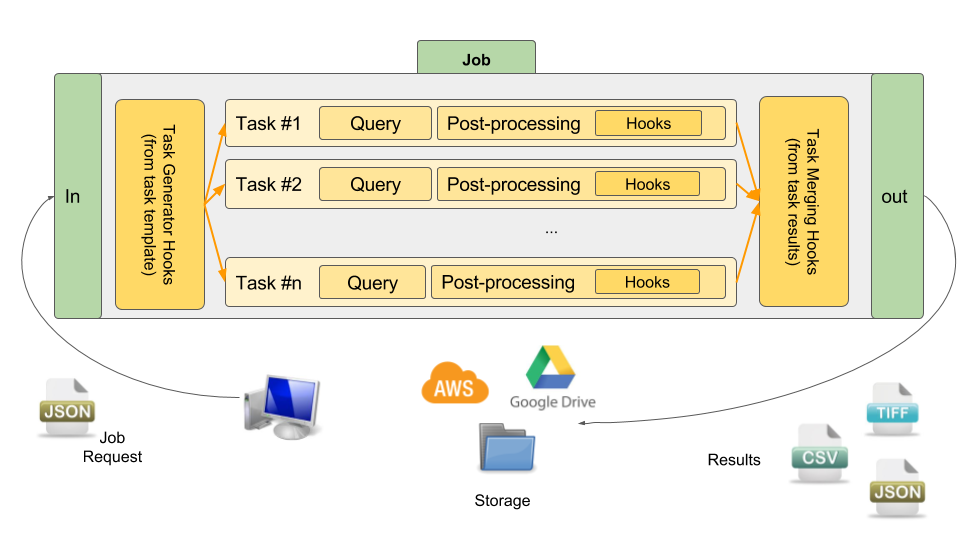

# Understanding Krawler

**Krawler** is powered by [Feathers](https://feathersjs.com/) and relies on two of its main abstractions: [services](https://docs.feathersjs.com/api/services.html) and [hooks](https://docs.feathersjs.com/api/hooks.html). We assume you are familiar with this technology.

## Main concepts

**Krawler** manipulates three kinds of entities:
* a **store** defines where the extracted/processed data will reside,
* a **task** defines what data is to be extracted and how to query it,
* a **job** defines what tasks are to be run to fulfill a request (i.e. sequencing).

On top of this, [hooks](https://docs.feathersjs.com/api/hooks.html) provide a set of functions that can typically be run before/after a task/job, such as a conversion after a download or task generation before a job run. More or less, this allows you to create a [processing pipeline](https://en.wikipedia.org/wiki/Pipeline_(computing)).

Regarding store management we rely on [abstract-blob-store](https://github.com/maxogden/abstract-blob-store), which abstracts a lot of different storage backends (local file system, AWS S3, in-memory, etc.), and is already used by [feathers-blob](https://github.com/feathersjs-ecosystem/feathers-blob).

## Global overview

The following figure depicts the global architecture and all concepts at play:

## What is inside?

**Krawler** is made possible and mainly powered by the following stack:
* [Feathers](https://feathersjs.com/) — the underlying services and hooks framework
* [Lodash](https://lodash.com/) — a JavaScript utility library, also used for [templating](https://lodash.com/docs/4.17.4#template)
* [gdal-async](https://github.com/mmomtchev/node-gdal-async) — the Node.js bindings of [GDAL / OGR](https://gdal.org/) used to process rasters and vectors
* [js-yaml](https://github.com/nodeca/js-yaml) — used to process YAML files
* [xml2js](https://github.com/Leonidas-from-XIV/node-xml2js) — used to process XML files
* [Papa Parse](https://www.papaparse.com/) — used to read and write CSV files
* [abstract-blob-store](https://github.com/maxogden/abstract-blob-store) — used to abstract storage
* [got](https://github.com/sindresorhus/got) — used to manage HTTP requests
* [node-postgres](https://github.com/brianc/node-postgres) — used to manage PostgreSQL databases
* [node-mongodb-native](https://github.com/mongodb/node-mongodb-native) — used to manage MongoDB databases

Krawler ships as a native [ES module](https://nodejs.org/api/esm.html) (`"type": "module"`) and targets **Node.js >= 20**.

## Going further

Once the concepts are clear, head to the API reference to learn how each entity is configured:
* the [services reference](../reference/services.md) details stores, tasks and jobs,
* the [hooks reference](../reference/hooks.md) details all the built-in processing functions,
* the [known issues](../reference/known-issues.md) cover advanced pipeline patterns (reusing hooks, parallelism, error handling).
