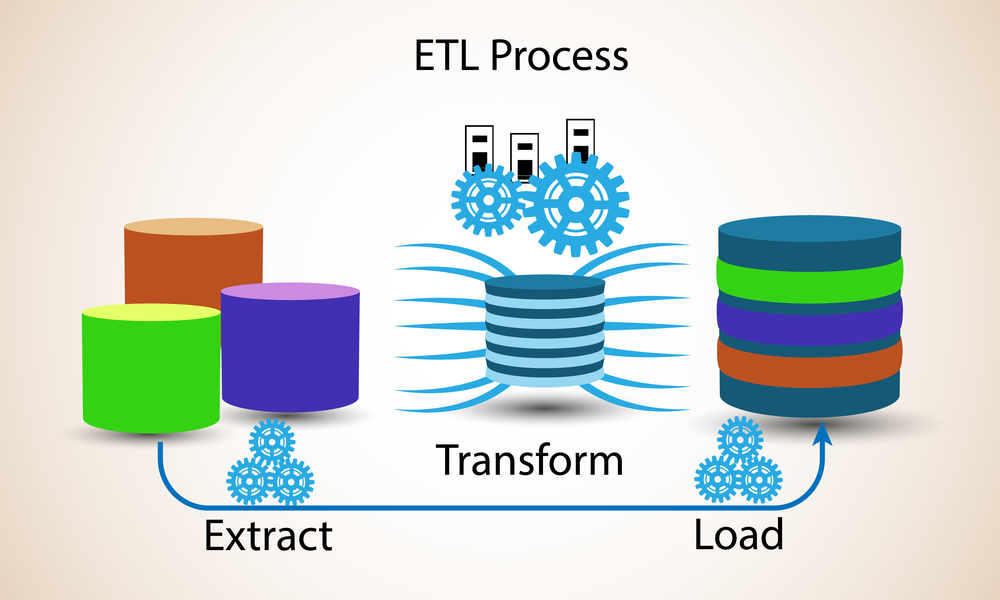

# krawler

_A minimalist (geospatial) ETL._

## Overview

Krawler aims at making the automated process of extracting and processing (geographic) data from heterogeneous sources easy. It can be viewed as a minimalist **Extract, Transform, Load** (ETL). [**ETL**](https://en.wikipedia.org/wiki/Extract,_transform,_load) refers to a process where data is
1. **extracted** from heterogeneous data sources (e.g. databases or web services);
2. **transformed** in a target format or structure for the purposes of querying and analysis (e.g. JSON or CSV);
3. **loaded** into a final target data store (e.g. a file system or a database).



ETL naturally leads to the concept of a **pipeline**: a set of processing functions (called **hooks** in krawler) connected in series, often executed in parallel, where the output of one function is the input of the next one. The execution of a given pipeline on an input dataset to produce the associated output is a **job** performed by krawler.

A set of introduction articles to krawler details:
* [the underlying concepts](https://medium.com/@luc.claustres/a-minimalist-etl-using-feathersjs-part-1-1d56972d6500)
* [the practical use case of geographical data processing](https://medium.com/@luc.claustres/a-minimalist-etl-using-feathersjs-part-2-6aa89bd73d66)

## Installation

Install the CLI globally with your preferred package manager:

::: code-group

```bash [pnpm]
pnpm add -g @kalisio/krawler
```

```bash [npm]
npm install -g @kalisio/krawler
```

```bash [yarn]
yarn global add @kalisio/krawler
```

:::

Or pull the ready-to-use Docker image:

```bash
docker pull kalisio/krawler
```

See the [installation guide](./guides/installing.md) for usage as a module, in development mode and as a Docker container.

## Documentation

The documentation is organized in two parts:

- **Guides** — a progressive walkthrough of the framework:
  - [Understanding Krawler](./guides/understanding.md) — main concepts and architecture
  - [Installing Krawler](./guides/installing.md) — CLI, module and Docker setups
  - [Using Krawler](./guides/using.md) — the job file, CLI options and healthcheck
  - [Extending Krawler](./guides/extending.md) — register your own stores, tasks, jobs and hooks
- **Reference** — the exhaustive API:
  - [Services](./reference/services.md) — stores, tasks and jobs
  - [Hooks](./reference/hooks.md) — the built-in processing functions
  - [Known issues](./reference/known-issues.md) — common pitfalls and their workarounds

If you intend to package a job image on top of Krawler, see also [Building Krawler jobs](../../building-jobs.md).

## What is inside?

Krawler is powered by [Feathers](https://feathersjs.com/) and relies on a curated stack, notably:

* [Feathers](https://feathersjs.com/) — the underlying services and hooks framework
* [Lodash](https://lodash.com/) — JavaScript utility library, also used for [templating](https://lodash.com/docs/4.17.4#template)
* [gdal-async](https://github.com/mmomtchev/node-gdal-async) — Node.js bindings of [GDAL / OGR](https://gdal.org/) used to process rasters and vectors
* [got](https://github.com/sindresorhus/got) — used to manage HTTP requests
* [js-yaml](https://github.com/nodeca/js-yaml) — used to process YAML files
* [xml2js](https://github.com/Leonidas-from-XIV/node-xml2js) — used to process XML files
* [Papa Parse](https://www.papaparse.com/) — used to read and write CSV files
* [abstract-blob-store](https://github.com/maxogden/abstract-blob-store) — used to abstract storage backends
* [node-postgres](https://github.com/brianc/node-postgres) — used to manage PostgreSQL databases
* [node-mongodb-native](https://github.com/mongodb/node-mongodb-native) — used to manage MongoDB databases

## License

Licensed under the [MIT license](https://github.com/kalisio/krawler-ekosystem/blob/master/packages/krawler/LICENSE.md).

Copyright (c) 2026 [Kalisio](https://kalisio.com).
